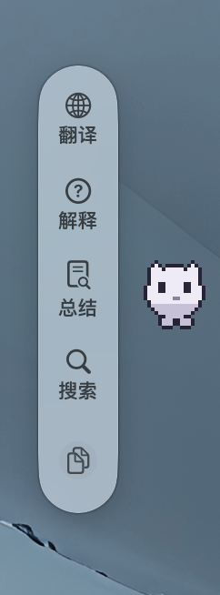
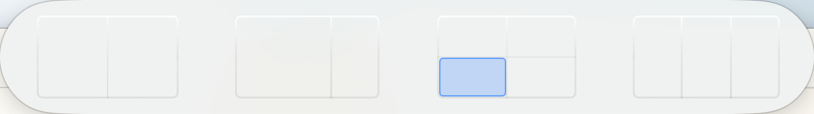

# Delores

<p align="center">
  <strong>原生 macOS 意图交互层 · 用最小充分形态，出现在任务发生的地方</strong>
</p>

<p align="center">
  
</p>

---

## 💡 产品发心与定位 (Product Intent & Soul)

> **发心第一，定位第二，设计第三。**

* **发心（Why）**：减少用户在 macOS 上“为了完成一个小任务，不得不频繁切换大窗口、在独立 App 之间反复复制粘贴上下文”的高昂认知与操作成本。无论你是划词偶遇生词、拖拽整理双屏、还是按下快捷键全局调度，Delores 始终以**最小充分形态**在手边唤醒，用完即退场，绝不霸占屏幕。
* **定位（What）**：**1 个共享能力核心 + 3 种原生形态（3 Surfaces / 1 Core / N Capabilities）**。Delores 不是三个独立的散装小工具拼盘，桌宠也不是独立应用。顶部划词（Context）、桌面伙伴（Companion）与全局指令中心（Command）共享同一套 AI、剪贴板、文本注入与窗口布局底层。

```text
Delores (1 Core)
├── 3 Surfaces (交互形态)
│   ├── Context Surface    (划词唤醒 · 顶部岛/卡片 · 即时问答/翻译/解释/总结)
│   ├── Companion Surface  (桌面桌宠 · 待命常驻 · 记忆与轻量交接)
│   └── Command Surface    (⌥ Space · 全局启动器/指令中心 · 最完整能力)
└── N Capabilities (底层共享能力)
    ├── AI Actions (流式生成 / 自定义 Prompt / 模型路由)
    ├── Window Placement (顶部分屏胶囊 / 智能吸附 / 拖拽分屏)
    ├── Clipboard & Search (剪贴板历史 / 本地与应用全局搜索)
    └── Text Injection (无缝回写当前上下文应用)
```

---

## 🌟 核心交互形态与实拍 (The Three Surfaces & Capabilities)

### 1. Context Surface —— 划选即所得的瞬时阅读岛

当你已经在阅读、写代码或浏览网页中选中了一段文本，Delores 的 Context Island 立即在屏幕顶部优雅浮现，提供最小必要操作；点击后平滑展开为三段式（Ready → Working → Result）轻薄结果卡，告别 Token 逐行跳动的视觉抖动。

<p align="center">
  
</p>
<p align="center">
  
</p>

* **瞬时就绪**：毫秒级响应划词手势，原生 Liquid Glass 毛玻璃质感；
* **三段式结果卡**：结论先行，大模型生成期间焦点防丢失常驻，支持复制与原地一键追问。

---

### 2. Companion Surface —— 灵动生机的桌面数字桌宠

你希望助手在手边陪伴却不打扰？可选开启桌面 Companion。你可以在 Delores 桌宠与 Codex 桌宠之间二选一：前者以经典复古像素艺术形态在屏幕边缘静谧巡游，后者作为 Delores 的外部视觉锚点，让划词工具栏与窗口分屏岛从 Codex 桌宠旁边出现；Codex 桌宠隐藏时自动回到菜单栏。

<p align="center">
  
</p>

* **真实步态动力学**：告别机械平移，引入落地顿挫与蹬地推进力学节奏；
* **智能避让**：自动感知全屏工作区并退让隐藏，切回桌面时无缝苏醒；
* **开源生态精选**：内置 11 款来自 Petdex 的经典治愈像素角色（祢豆子、柴犬 July、小龙虾、鲸鱼豆豆、罗小黑、莉莉娅等）。

---

### Capability: Spatial Window Snap —— 直觉式顶部窗口分屏胶囊

这是 Window Placement 能力的瞬时入口，不是第四种产品形态：它只在用户已经拖动窗口时出现，手势结束后随即退场。

整理多窗口不需要记忆复杂的快捷键组合。当你拖拽任意应用窗口贴近屏幕顶部边缘，Snap Island 自动浮出分屏比例预选胶囊（二分屏、黄金比例 1/3+2/3、四象限、三分屏）。

<p align="center">
  
</p>

* **无感手势仲裁**：手势归一，不与系统全屏冲突，拖入对应卡片即可瞬间规整工作区；
* **Split Divider 记忆**：拖动吸附后可自由微调中缝比例并自动保存记忆。

---

### 3. Command Surface —— 最完备的全局指令与启动层

按下 `⌥ Space`，唤出强大的全局 Command 面板。作为 Delores 最完备的形态，它承载全局应用搜索、系统命令、剪贴板管理、沉浸式长对话以及个性化设置。

<p align="center">
  
</p>

---

## 🛠️ 架构与工程规范 (Engineering Discipline)

- **产品宪法**：任何设计与技术决策优先服务于发心与定位。详见 [docs/delores-product.md](docs/delores-product.md)。
- **架构约定**：3 Surfaces / 1 Core / N Capabilities，详见 [docs/delores-architecture.md](docs/delores-architecture.md)。
- **Action Core 演进**：统一 ActionSession 运行时，避免多套 Runtime 碎片化，详见 [docs/delores-action-core.md](docs/delores-action-core.md)。
- **上游同源继承**：以 Tinycast 优秀且成熟的 Launcher/Search 为基础基石，保持上游同源跟踪机制，详见 [ADR 0001](docs/adr/0001-keep-tinycast-as-upstream-overlay.md)。

---

## 🚀 本地运行与验证 (Build & Verify)

本项目基于 Swift / macOS 原生开发，需 macOS 26 与 Xcode 26 环境支持。

```sh
# 运行纯 Delores 模型逻辑测试套件
./Scripts/run-delores-tests.sh

# 运行集成测试
./Scripts/run-huaci-integration-tests.sh

# 打包带签名的本地 DMG 安装包
./Scripts/build-delores-dmg.sh
```

---

## 📄 开源协议与鸣谢 (License & Notice)

Delores 遵循 **GNU Affero General Public License v3 (AGPLv3)** 或更高版本。
部分像素宠物资产来自 [Petdex](https://petdex.dev/) 开源社区，版权归原作者所有，完整说明与鸣谢见 [NOTICE.md](NOTICE.md) 与 [LICENSE](LICENSE)。
