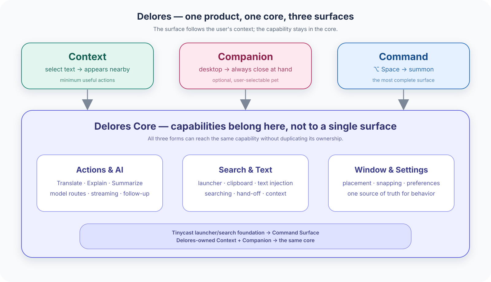

# Delores architecture and upstream sync

## Three surfaces, one core, N capabilities

Delores is one tool that appears in three forms. A **Surface** is where the reader is; a
**Capability** is what gets done, and it belongs to the core rather than to any one form. `CONTEXT.md`
carries the definitions; this is how they are laid out.



| Surface | Summoned by | What it is for | How much of Delores it shows |
| --- | --- | --- | --- |
| Context | a selection gesture | The minimum actions for the text the reader has just selected | The least |
| Companion | always there, once enabled | Being findable: a glance, the last selection, a hand-off | Very little |
| Command | ⌥Space, or any hotkey bound to the palette | Searching, commands, Chat, anything long-running | Everything |

Behind them sits the core: AI actions and the model routes bound to them, Search, Clipboard, Text
Injection, the window placement engine, Settings. A surface presents a task and renders a result; it
does not own the capability that produced it. `Action` is the word for one capability reachable from
more than one surface, and it is why the catalog is not copied per surface.

Two things that are deliberately **not** surfaces: window snapping and the split divider. They are
window-placement capabilities with a transient affordance attached to a gesture the reader was making
anyway. They have no place to be and nothing of their own to say.

### Where each one is

- **Command** — Tinycast's palette, unchanged, and meant to stay that way. It is the mature one and it
  carries the long tail: search, commands, Chat, Settings.
- **Context** — the shape is the toolbar's now. The bar, the card, the follow-up field, the expansion
  geometry, the pointer physics and the Escape order all match the vendored reference, which was
  re-read from source and rendered to check rather than assumed. What it still carries itself is its
  own catalogue, prompts and streaming — see below.
- **Companion** — either the running Delores pet or the Codex pet as an external visual anchor, never
  both. Delores mode owns wander, hover, click grammar, and a double-click that reopens the last
  selection's Context Surface. Codex mode never starts the native pet: the Context toolbar and Spatial
  snap island may grow from a uniquely identified Codex overlay. The selection bar follows the pet's
  display even when the selection is on another display; while the pet is visible, snap uses the pet
  rather than the top-centre trigger. Both return to their menu-bar/top-centre fallback when Codex's
  pet is hidden or its local overlay bridge is unavailable. The bridge reads the mascot's live DOM
  rectangle over Codex's loopback DevTools endpoint at 127.0.0.1:9341, then checks WindowServer to
  confirm its overlay window is on screen; it does not modify Codex's renderer.

The gap between the surfaces and the core, measured against both catalogues, is written up in
[delores-action-core.md](delores-action-core.md): what each side has, what the same word means on each,
and the one shape that can carry both. Read it before moving action execution anywhere.

## Current implementation boundary

```text
selection gesture
    → DeloresCoordinator
    → DeloresContextCoordinator
    → Context Island
    ├─ an action press → its own card, streamed on that action's own route
    ├─ a completed result → Continue in Command → AIChatCoordinator → the chat surface in the palette
    └─ a future explicit hand-off action → AIChatCoordinator → the chat surface in the palette
```

The island owns its own catalogue. `DeloresContextAction` defines the four shipped rows
(translate/explain/summarize/search) with their prompts, and which of them rewrites the selection.
Custom rows are written in Context Surface settings into the same store Quick Actions uses, and join
those four on the next selection. The island
reads exactly five things from Quick Actions and nothing else: the rows the reader wrote in Settings, a
per-action prompt override they wrote there, the model route bound to an action id
(`quickActions.provider(forActionID:)`), the backend that route means for `translate`
(`quickActions.translateRoute(for:to:)`, below), and the one language both surfaces translate into
(`quickActions.targetLanguage`). `DeloresContextCoordinator.answer` builds the `AIRequest` and hands
the provider's stream to `DeloresActionSessionRunner`, which owns reading it: the accumulation cap, the
stop and the empty-result rule belong to the session, and both surfaces get the same ones.

**`translate` is one id with two backends**, and it is the one row whose press is routed before
anything is drawn: `DeloresActionDefinition.translationRoute` answers with Apple's translator unless
the reader bound a model to that id or Apple cannot do the pair, so the card either takes the
framework's one finished string or streams a model's answer. 重试 repeats the lane the reader saw, and
a follow-up question is always a model's turn, handed the framework's answer as settled context. Quick
Actions asks the same method, so the bar and the palette cannot disagree about what 翻译 means.

It does **not** hand a press to the Quick Action result surface. Earlier in the project a Context press
did exactly that, and the four Actions were native Quick Actions keeping their own preview and
diff/replace semantics. That is no longer the code, and this section used to say it was. What survives
is the escalation seam: an action whose `kind` is `.ask` grows the island and hands the captured
selection to `AIChatCoordinator`, and `requiresChatHandoff` is `kind == .ask`. No shipped row is
`.ask`; the current product entry is the completed result card's **Continue in Command** button,
which builds a dedicated `DeloresCommandHandoff` prompt so both the selection and the result travel to
Chat without adding a permanent Context row.

Chat remains an explicit escalation rather than the destination of every press. The handoff
infrastructure still carries per-turn instructions, provider and guardrails for those future entries.

`quickActionsEnabled` is still the opt-in boundary for the Context Surface, because both need the same
Accessibility permission. A separate Context switch should only appear when the product needs
independent control, so the consent semantics do not split prematurely.

## The three entry points

One capability set sits behind three summons, and each summon gets the Surface that fits the input
rather than one surface with swapped contents. `CONTEXT.md` already names the rule under *Surface
Arbitration*, *Gesture Admission* and *Action*; this is where it is carried out.

| Summon | Surface | What it is for |
| --- | --- | --- |
| ⌥Space, or any hotkey bound to the palette | Command | Summoning, searching, starting a task the reader has in mind |
| A selection gesture | Context | The minimum actions for text the reader has already selected |
| A press on one of those actions | Context | Run that action on the captured text, and stream the answer into the card |
| A press whose action is `.ask` | Command, in the chat | Escalate the captured selection for more turns, another model, or reasoning |
| A click on the Companion | Companion | Reopen the last selection, or say something about having nothing to work on |

Window snapping and the split divider are not in this table because they are not summons: they are
capabilities that answer a gesture the reader is already making, and they take no one anywhere.

The Context Surface is a window of its own, not a compact mode of the palette. The palette's default
anchor is a fraction of the way down the visible frame (`paletteTopMarginFraction`), while a context
action belongs at the status bar; the two cannot share one window without moving where ⌥Space puts
the palette.

**The status bar is not its only home.** With the Companion on, a bar grown for a selection the
Companion handed over hangs off the body's inward side instead — `DeloresCompanionShell` decides where,
and reports when the body had to slide along its own edge to make room, because the Companion owns its
window and is the only thing that can move it. The bar's long axis follows the body's edge: horizontal
under a top/bottom pet, vertical beside a left/right one, with the strip against the pet's side edge
acting as the spine the card grows away from. While such a bar is up the body stands still: one that
walked out from under the bar it opened leaves that bar over nothing. Without a Companion — or with its
body off screen — the bar goes back to the menu bar, which is its ordinary home, and the reason every
part of `DeloresContextCompanionHosting` is optional as a whole rather than piece by piece.

Standing on this display's menu bar is still standing here. The body walks `screen.frame`, so a
selection must not treat `visibleFrame.contains` as "on this display" and fetch the body to the
visible-frame midpoint.

The Companion's right-click menu is a shell of the same kind, placed by the same call: a body near a
corner and a menu that does not fit are resolved once, for all three. Like the island it is ordered in
without key and never takes one, so the way out of it is a click away rather than Escape.

**Its size is a setting, and the geometry takes that size as a parameter.** Two steps and no others —
48 and 96 — because the sprite is authored at a fixed size and drawn at a whole number of its own
pixels; anything between the two puts a fractional number of screen pixels under one drawn pixel,
which is what shimmers. Where a shell may go is a question about the body's edge, so
`DeloresCompanionShell` takes `bodyRadius` as an argument rather than reading a constant: the model
stays pure, one geometry serves both steps, and the size can be changed without re-deriving any of it.

Arbitration is by the keyboard, and only the palette takes it by being summoned. The island is
ordered in without key (`becomesKeyOnlyIfNeeded`): it appears over a selection the reader may still
be editing, so ⌘C, ⌘X and Delete must reach their app, and the bar answers for the keyboard only
after the reader clicks into its follow-up field. A click elsewhere closes it, watched directly
because a bar that never held key has no key to lose; one of our own windows taking the keyboard
(`NSWindow.didBecomeKeyNotification`) closes it too, which is how the palette summons the island out
of the way — and a fresh selection over the palette still drops the palette, so neither has to
know the other exists and no single input closes both.

The one exception is a pinned Context Surface, which is a window of ours taking the keyboard on
purpose rather than the reader leaving the app. `PaletteWindowController.windowDidResignKey` asks
`AppCore.isHoldingPinnedContext` and, only then, waits a runloop turn to see whether one of our own
windows still holds key. A resign that left the application still hides the palette, so the chat is
never left floating over another app.

Escape follows the same rule where the surface holds key: the Command Surface in
`PalettePanel.sendEvent`, the Context Surface in `DeloresContextIslandPanel.sendEvent`. Because the
island takes key only on demand, an Escape pressed at the bar before that belongs to the reader's
app — the deliberate cost of not stealing the keyboard over a fresh selection. While the card is
opening it also cancels the press, because `onAction` does not fire until the growth ends.

The handoff animation is now reserved for the result card's explicit **Continue in Command** escalation.
Catalog actions
(translate / explain / summarize / search, and any custom row) execute in the Context Surface's own card. They do not
leave through the Quick Action admission path, and they do not open Chat.

Two differences between the surfaces are recorded rather than resolved, because each direction is a
visual decision of its own:

- **Material.** The Context Surface draws with Liquid Glass (`Theme.frosted`), carried over from the
  toolbar it came from. The palette draws with `NSVisualEffectView(.hudWindow)` under a
  reader-configurable scrim. The Companion draws with no material at all — a pixel sprite on a
  transparent panel — so it is the artwork's own outline that has to carry it against a pale
  wallpaper. The first two are on screen together only across the hand-off's fade, and they were left
  as they are on that basis.
- **Window level.** The island is at `.statusBar` so it sits over both of its anchors — the menu bar,
  its ordinary home, and the Companion (`.floating`) a bar can be grown out of beside; the palette is
  at `.floating`. Across the hand-off the outgoing island therefore draws over the
  incoming palette until its exit fade (`Theme.Duration.exit`) ends.

## What Pin holds

The Context Surface can be pinned from its own bar (`DeloresContextIslandController.isPinned`).
The toolbar this island came from pinned the expanded panel that was holding an answer; here the
selection is the durable object: the island stays put and the same captured text stays behind its
actions. That is the state a reader wants when they are about to press a second action on the same
text.

Pinned, and only while pinned:

- A new selection passes by. `DeloresContextCoordinator.captureSelection` drops the gesture before
  it reads anything, so neither the clipboard nor the recorded selection state is disturbed.
- An outside click passes by. `windowDidResignKey` is the only way this surface used to leave without
  being asked.
- An action press does not take the bar away. Every catalog action answers in the island's own card
  (`DeloresContextCoordinator.answer`), so `releaseSurface()` has nothing to do and the held selection
  stays behind the bar. A press on the chat hand-off route is the one exception: its growth exists to
  carry the reader *out* of the island, while the pinned island remains as the held context.

Escape and the close button still get out, and either one clears the pin with the panel. The toolbar
drew the same line: a pinned panel there still answered Escape.

**The chat hand-off joins a chat that is already on screen instead of starting over.** A chat the
reader can see is a conversation, and replacing it would take away the answer they were reading.
`AIChatCoordinator.isChatOnScreen` reports the fact; the choice stays with `DeloresContextCoordinator`.
The result card is the only current button that reaches Chat. 问 AI was retired as a duplicate of 解释,
and no permanent catalog row replaces it. `DeloresCommandHandoff` carries the captured selection and
the completed answer as context, while a Chat already on screen receives the same prompt as another turn.

## Asking again

A card can be asked for more than one answer, which is most of why it is a card rather than a toast.

- **Stop** ends a reply that is still arriving and keeps what it produced. Cancelling the task is the
  whole mechanism — the streaming loop recognises the cancellation and settles the card itself, so there
  is one place that decides what a stopped reply looks like. `cancelAnswer()` is a different thing and
  stays that way: it invalidates the generation, so a card the reader has left behind never writes to the
  surface that replaced it.
- **Retry** asks the same action about the same text again, from the first turn. Carrying a half-answer
  back into the request would ask the model to continue one, which is not what the press means.
- **Follow-up** asks a further question on the same action and the same selection, carrying the exchanges
  already settled. It stops at ten exchanges, and at eight thousand characters a turn, trimmed
  oldest-first and in pairs: an unpaired question teaches a model to answer something nobody asked.

None of them leave the island. The selection stays behind the bar, so a second go never means going back
and selecting the text again — which is the same thing Pin is for, one press shorter.

## Sizing the Context Island

The bar hugs its controls, so its width is measured from its content — and that measurement is taken on
a copy of the view that is never handed a frame, because a view told its own width cannot report what
width it needs.

The frame the controller then chooses is *imposed on the content*, not merely applied to the panel, and
that is load-bearing rather than defensive. An `NSHostingView` installed in a window also sizes that
window: SwiftUI's `windowDidLayout` runs `updateAnimatedWindowSize` and animates the panel to the ideal
size of whatever it is hosting, the controller's frame included, and `sizingOptions = []` does not stop
it. Measured on this machine before the fix: the controller set the panel to 497pt, the window server
reported 428pt, the bar laid itself out at 428 where every title collapses to an ellipsis — and, a
truncated bar being a narrower bar, the size SwiftUI then aimed for was the truncated one. Pinning the
content to the vessel makes the two numbers identical, so there is nothing left to resize to.

No unit test covers this: the island's UI layer is outside the harness's compile list. The check that
does cover it is reading the panel's real bounds from outside the process
(`CGWindowListCopyWindowInfo`) and comparing them with the size the controller chose.

When the Companion is standing on a vertical edge, an opened vessel is at least as tall as the
vertical action strip, including its pin, collapse and close controls. The compact working card must
not keep its horizontal height in that state, or the strip's last action is clipped while a reply is
starting. The vessel shape is clipped once at the root so the card and strip share one continuous edge.

## Phase 1.5 boundary

`AppCore` now exposes only `DeloresCoordinator`. The coordinator owns the current Context Surface
implementation and is where Surface arbitration lives. `deloresCompanionMode` is the one mutually
exclusive choice for the Companion: `.off`, `.delores`, or `.codex`; the old boolean is read only once
to migrate an existing install.

Selection gesture admission uses a window snapshot policy: only visible windows that accept mouse
events block selection detection. HUDs and drop guides remain pass-through. Quick Action admission
returns `started`, `busy` or `disabled`; the Context Island closes only for `started` and shows an
explicit busy state otherwise.

### Surface arbitration

Two surfaces can see the same mouse gesture: the Context Surface reads a release as a completed
selection, and Spatial reads a drag as a window move or a seam resize. `DeloresSurfaceInteractionGate`
(`Model/OwnSurfaceHitPolicy.swift`) is the single owner that decides which one gets it.

- Spatial claims the gate (`.snapping` or `.divider`) only once the gesture is unambiguously its own:
  snapping waits until the candidate window's AX frame has really moved by 20pt, so dragging across
  text does not claim it. The Companion claims `.companion` while it is captured.
- The Context Surface drops a gesture while the gate is held, **and for 350ms after it is released**.
  The release that ends a Spatial drag is the very event selection detection reacts to, and it asks
  about it a beat later, so letting go has to keep covering the gesture rather than reopening it.
- Only one surface can hold the gate at a time, and a release from a surface that no longer holds it
  is ignored, so a late `mouseUp` cannot free someone else's gesture.
- A drag that starts on the Codex pet is ignored by both selection and window-snap admission. A normal
  window drag that ends over the Codex pet still belongs to Spatial and opens the same snap island.

Unit-tested in `Tests/delores-context-test.swift`. The gate covers input admission; it does not
replace the per-surface hit testing above.

### Ownership map

### Spatial / Companion (Delores-owned)

`DeloresCoordinator` holds the Context, native Companion, Codex window probe, window snap and split
divider children. They share one `DeloresSurfaceInteractionGate`. `AppCore` observes the four persisted switches
(`quickActionsEnabled` plus Companion / snapping / divider) and calls `applyEnabled()`, which starts
or stops each child independently.

Companion, snapping and the divider may be on together; a gesture belongs to one owner. The Companion
claims `.companion` while captured, snapping claims `.snapping` once the candidate window has
actually moved, and the divider claims `.divider` on the seam press. These coordinators do not compile
Huaci's `AppDelegate`, `ConfigManager`, `SelectionMonitor`, `LLMService`, or `main.swift`.
Companion double-click reopens the last captured selection on the Context Surface. Settings live under
the `Companion & Windows` pane.

How the Companion moves is `Model/CompanionWander.swift`: it stands still, walks one trip along its
loop to a destination it drew, then stands still again. The loop is `Model/CompanionLoop.swift` — the
display's whole frame, less the stretches the body may not walk: the ends of the menu bar, because
that is where the icons are, and the Dock, which it goes *around* rather than over. Where the loop has
a gap the body turns back at the end of a run; where it closes it walks round and round, which is what
an ordinary display still is. Rests and trips are both
short-bodied and long-tailed, a trip holds one speed from end to end, and a destination is never the
spot the last one left — an even rhythm at a constant speed is what makes a thing read as mechanical
rather than as occupied. Randomness is injected rather than drawn, so the whole thing replays from a
fixed seed in `Tests/delores-context-test.swift` and is asserted rather than watched. Resting runs no
frames at all: the coordinator schedules a single wake for the moment a rest ends.

Runtime ownership has moved to Delores: each coordinator has its own panels and geometry rather than
bridging Huaci's managers, and the vendored sources are a behavioural reference plus a regression
harness.

The old Ghost XOR Companion exclusion is gone. Huaci turned snap and the divider off whenever the pet
started. Delores treats those as capabilities that can be enabled together; only the live gesture is
exclusive. With the pet on, dragging a window over its body opens the snap island beside the pet —
`planIslandOpening` places it with its long axis along the pet's edge, a horizontal island under a
top/bottom pet and a vertical one beside a left/right pet. The top-center trigger survives only as
the no-pet fallback: with the pet off, or its body off that screen, the island opens at the top of
the display as it always did.

Two rules keep that reachable, and both are asserted in `testCompanionShell` rather than watched.
An island is placed off the body where it actually stands and only then clamped to the display — the
body is never moved to make room for one, because a drag chose a body standing there. And the body
plus the island it grew are one target for the whole climb: the seam between them is `shellGap` of
dead space otherwise, and a drag crossing it in a single frame would take the island down mid-drag.
The body walks the display's *whole* frame while a shell is placed against the visible one, so those
two differ by the Dock and the menu bar, which is exactly the gap the first rule closes.

**Still experimental.** The following are known gaps, not oversights, and none of them is covered by an
automated test. They are the Spatial half of the story; the full designed-but-unbuilt inventory,
including items outside this document's scope, is kept in [delores-backlog.md](delores-backlog.md):

- `findSplitPair` filters on-screen windows spanning the pointer's height, but does not yet exclude
  occluded windows, other Spaces, or apps whose focused window is elsewhere. Snapping captures the
  frontmost app's focused window at the press.
- The seam scan walks the window list on a throttled 80ms timer; a cached pair is re-read from AX
  instead, which is cheaper but still IPC on the main actor.
- Window eligibility is `isEligible` + position-settable. There is no per-surface rollback beyond the
  divider's own, and no Space/full-screen/display-change observers beyond the Companion's screen
  notification.
- Accessibility is checked per gesture (`Permissions.isAccessibilityTrusted()`); the grant is
  requested from the Settings pane where the reader turns the feature on, never at launch. Without it
  neither snap nor divider engages, and the Settings pane says so.
- Companion click-through and multi-display behaviour have no test and require manual acceptance on
  the machine's real displays. The wander is not among them: it is asserted from a fixed seed.


| Area | Owner | Sync posture |
| --- | --- | --- |
| Palette, AI providers, Keychain, TextInjector, window engine | Tinycast | Inherit upstream |
| Notes editor, switcher and search | `Tinycast/Features/Notes/`, `Tests/notes-*.swift`, `docs/features/notes.md`, `website/content/docs/features/notes.md` | **Restored 2026-09-19 from tag `v0.11.3-beta.98`**, verbatim, after the pack move parked it. Upstream-owned on purpose: a later upstream Notes change is diffable against these files rather than against a fork. Bringing it back also restored the wiring below. Two files have since moved off the tag for the folder setting below: `NotesSettingsView.swift` gained one call to `NotesLocationSection`, and `NotesRepository`/`NotesStore` gained a directory that can move |
| Notes folder | `AppSettings.notesDirectoryPath` / `AppSettingsKey.notesDirectoryPath`, `AppPaths.notesDirectory(chosenPath:)` and `defaultNotesDirectory()`, `NotesStore.useDirectory(_:)`, `NotesRepository.notesDirectory`, `NotesCoordinator.chooseNotesDirectory()`/`restoreDefaultNotesDirectory()`/`revealNotesDirectory()`, `Notes/Settings/NotesLocationSection.swift`, `SettingsAnchor.notesLocation`, `SettingsSearchCatalog` | **Delores-owned; upstream has no such setting** — it fixes the folder to the channel's own support directory. `NotesRepository.notesDirectory` became a `var` and its initializer takes the folder itself rather than a channel root, which is the whole of the storage change: `validatedFileURL` already derived its containment check from that property, so a switch re-points the guard with it. The setting is in `SettingsBackupCoverage.deliberatelyExcluded`, and the pane's copy is six more `Localizable.xcstrings` keys |
| Notes wiring — settings, commands, backup, lifecycle | `AppSettingsKey`/`AppSettings` (`notesEnabled`, `notesRendersMarkdown`, `notesShowsFormattingBar`), `SettingsTab`/`SettingsAnchor`/`SettingsDetailView`/`SettingsSearchCatalog`, `CommandID`/`CommandCatalog`/`LauncherCoordinator`, `BackupCategory`/`BackupBundle`/`BackupComposer`/`BackupApplier`/`BackupActions`/`SettingsBackup`/`SettingsBackupCoverage`, `AppCore` (`notesStore`, `notesCoordinator`, `flushNotesForTermination`), `AppDelegate`, `DesignSystem/Theme.swift`, `website/content/docs/features/meta.json`, `website/src/data/features.ts` | One seam each, sourced from the tag rather than from the reverse of the pack move, so the wiring matches the restored code. `SettingsTab.title` and the pane's copy go through `L10n` because Delores localizes chrome where upstream does not; the six new `Localizable.xcstrings` keys are the only copy Delores authored. The two website files put the page back in the sidebar and on the long-tail card list — the park had removed all three, and the `notes` icon in `feature-icons.ts` was left behind, so nothing new was drawn |
| Drained subprocess helper | `Tinycast/Platform/ToolRunner.swift`, `Tests/tool-runner-test.swift` | **Adopted out of the parked Updates pack** by `597cad74`, because Apple Shortcuts needed the same helper and upstream keeps its copy inside the feature this fork parked. Delores-owned from there, so the pack keeps upstream's original and a restore takes this file — see "The subprocess helper two features share" |
| Selection gesture and Context Surface | `Features/Delores/` | Delores-owned |
| Shared task snapshot | `Features/Delores/Model/InvocationContext.swift` | Stable seam |
| Quick Action entry with a captured selection | `QuickActionCoordinator` | **Withdrawn**: the selection-aware `run` overload and its `begin(selectionOverride:)` were removed when the Context Surface stopped executing native Quick Actions — its catalog is its own, and the whole overload had no remaining caller |
| Per-action route for a Context Surface action that no Quick Action backs | `AppCore.quickActionProvider(forActionID:)`, `QuickActionSettingsStore.model(forActionID:)` **and now `modelOverride(forActionID:)` / `setModelOverride(_:forActionID:)`**, `QuickActionCoordinator.provider(forActionID:)` | One small integration seam. Id-keyed, so a per-action model binding survives a catalog Delores owns; `quickActionProvider(for:)` and `model(for:)` now delegate to these, so no behaviour moved. The two by-id accessors were added when the bar's rows got a settings section of their own — the read existed, the write did not, and `setModelOverride(_:for:)` cannot serve an id like `explain` that no `QuickAction` can be made from |
| Reader-replaceable per-action prompt, reached by id | `QuickActionCoordinator.instructionOverride(forActionID:)`, `QuickActionSettings.instructionOverride(forActionID:)` | The Context Surface applies it to any catalog row whose id is also a `BuiltInQuickAction`, so a prompt rewritten in Settings reaches the bar. Id-keyed for the same reason the model route is: the two catalogues overlap without agreeing. `provider(for:)` is **still unreferenced** — delete them the next time the chat handoff is designed and they remain unused |
| Custom Quick Actions on the Context Surface | `QuickActionCoordinator.customQuickActionRows`, `DeloresContextAction.available(aiEnabled:customActions:)`, `ContextSurfaceSettingsView` | Settings writes them through the same store Quick Actions uses; the island only copies. The row's entry id is its binding key, so a model bound in Settings survives the trip |
| Result-card Continue in Command handoff | `DeloresCommandHandoff`, `DeloresContextCoordinator`, `AIChatCoordinator` | One small integration seam; the CTA carries the selected text and completed answer without adding a Context row |
| Palette dismissal while the reader holds a pinned Context Surface | `Palette/PaletteWindowController.swift` | One guarded branch in `windowDidResignKey`, scoped to `AppCore.isHoldingPinnedContext` |
| App lifecycle wiring | `AppCore`, `DeloresCoordinator` | One small integration seam |
| Own-surface event admission | `OwnSurfaceHitPolicy`, `OwnSurfaceHitTester`, `DeloresSurfaceInteractionGate` | Explicitly marked interactive surfaces only; ordinary windows such as Settings stay out, pass-through overlays remain transparent, and one gesture belongs to one surface |
| Quick Action admission | `QuickActionStartResult`, `QuickActionCoordinator` | Shared capability returns an explicit start result |
| Product identity and build metadata | `project.yml`, generated project, `Info.plist` | Delores-owned seam |
| Delores model gate | `.github/workflows/ci.yml`, `Scripts/run-delores-tests.sh` | Delores-owned seam |
| Local packaging and release gate | `Scripts/build-delores-dmg.sh`, `docs/delores-release.md`, release workflow guard | Delores-owned seam |
| Latest Huaci source and regression harness | `Integrations/HuaciGongju/`, `Scripts/run-huaci-integration-tests.sh` | Vendored integration; explicit adapter required |
| Quick Actions consent copy | `Features/QuickActions/Settings/QuickActionsSettingsView.swift` | Delores-owned seam |
| Where an agent is told the Delores contract exists | `AGENTS.md`, one row in its "Read it before you" table | The only Delores content in an otherwise untouched upstream file. The rule itself lives in this document and in `CONTEXT.md`; the row exists so an agent that only ever reads `AGENTS.md` still finds them |

### The deliberate divergences the restore left behind

Three things were **not** taken verbatim, each for a reason that would otherwise be invisible to
whoever diffs this against upstream next.

The tag's Notes needed two `DesignSystem` changes that arrived upstream between the park and the tag.
Each was taken as far as Notes needs it and no further, because the rest would have restyled chrome
Delores had already tuned:

- **`Tooltip` gained `alignment:` and nothing else.** Upstream rewrote the tile in the same release —
  a delay, a rounded window-background card, a shadow, and a keycap form. Notes only asks to align a
  tooltip against a narrow window's edge, so `TooltipModifier` takes `alignment` and keeps Delores'
  capsule. Adopting the rest is a deliberate visual change to every tooltip in the app, and it has not
  been made.
- **`BarButton` gained `isSelected` and `isCompact` and nothing else.** Both default `false`, so every
  existing call site renders exactly as before; upstream's other change in that file (`HeaderMenuSymbol`,
  built on `SystemSymbolName`, which Delores does not have) was left out.

The third is copy, not chrome:

- **The website pages are restored from the tag with the still-parked features edited out.** The park
  (`2addf5db`) took Notes off the site in eight places, so un-parking it means putting them all back:
  the page itself, `features/meta.json`, the long-tail card in `website/src/data/features.ts`, a row
  each in `reference/settings.md`, `reference/backup.md`, `launcher/commands.md` and `docs/index.md`,
  the whole `## Notes window` table in `reference/shortcuts.md`, and one name in
  `reference/hotkeys.md`'s switch list. Two edit shapes are deliberate:
  - **The Snippets sentence is dropped.** Upstream ends the editor section with
    "[Snippets](/docs/features/snippets) expand right into the editor, and undo takes them back."
    Snippets is still parked and its own site page says so, so the link would contradict the paragraph
    it came from. A reader of this build cannot expand a snippet, so there is nothing to describe.
    Restore it together with the Snippets pack. The reciprocal line in `features/snippets.md` stays
    out for the same reason. `NoteTextView` still adopts `InjectableTextView` and is still the only
    adopter — that seam stays live and documented in [features/notes.md](features/notes.md).
  - **Rows are written at the local table's level of detail.** The tag's `reference/settings.md` calls
    the Notes pane "Notes commands"; the local table lists every other feature's settings by name, so
    the row names `Render Markdown` and `Show Formatting Bar` instead. Same for the backup category
    and data-location rows, which are phrased to match their neighbours rather than copied.

All three are the kind of seam this document exists to record: small, additive, and reversible by taking
upstream's file whole once someone wants the redesign.

Do not rename the upstream `Tinycast/` directory, upstream source files, or the generated project
structure merely to make the product name look uniform. That creates avoidable conflicts on every
upstream update.

### The subprocess helper two features share

`Tinycast/Platform/ToolRunner.swift` is not an upstream path. Upstream keeps the same helper under
`Tinycast/Features/Updates/Service/ToolRunner.swift`, inside the feature this fork parked, and `597cad74`
copied it to `Platform/` so Apple Shortcuts could use it without un-parking the updater. From that point
on it belongs to no pack, which is a seam worth stating twice:

- **The pack keeps upstream's original, byte for byte.** `Packs/LegacyFeatures/Updates/Service/ToolRunner.swift`
  is still identical to what tag `v0.11.3-beta.98` holds at upstream's path, so it stays diffable. A
  restore of the Updates pack therefore takes the active file and drops that copy rather than reviving
  it, and the pack README says so. The two are deliberately not identical, and a drift check asserting
  that they are would be asserting the wrong thing.
- **The active file is Delores-owned and has moved on.** It is the one utility the app's other
  subprocess calls are built on, and it had two waits that could never end. Its timeout only sent
  `SIGTERM` and still waited on an exit that a tool ignoring the signal would never produce; and its
  drain ended with a `readToEnd` that blocks until *every* writer closes the pipe, including a child the
  tool left behind. Either one could hold `AppleShortcutCoordinator.refreshTask` open for the life of
  the process, after which its own guard drops every later refresh. Both were reproduced before being
  fixed: the old file, unchanged, failed to return from `run` after six seconds in each case. The pipe
  now has exactly one reader, the exit and the end of the file are joined before the answer is read, and
  the budget escalates `SIGTERM` → `SIGKILL` → a bounded wait that ends even when nothing else does.
  `Tests/tool-runner-test.swift` pins all of it, including that a tool which writes before its own child
  outlives it still yields both its output and a truthful status.

## Naming: what is still called Tinycast, on purpose

The rename is not total, and the residue is deliberate rather than unfinished. Everything that leaves
the process or reaches a person was changed; this is what was kept, so it does not get relitigated:

| Still `tinycast` | Why |
| --- | --- |
| `com.tinycast.backup` in `Info.plist` | Declared **imported**, not exported. It is upstream's identifier, and it stays declared so a backup written before the rename still opens. Exporting it would claim it as Delores'. |
| `Tinycast.xcodeproj` and the `Tinycast` target | Generated from `project.yml`, and the name is load-bearing for merging upstream. The **scheme** is `Delores`, which is what every command uses. |
| `tinycast://…` row identities in the launcher | Internal placeholders. `AppLauncher.open` is reached only for "Open in Browser", nothing registers the scheme, and `tinycast` in the env of the login shell is a marker for the reader's own rc file. Changing either would move persisted alias and ranking keys for no visible gain. |
| `com.tinycast.perf` (os_signpost), `com.tinycast.capslock-remap` (queue label) | Process-local labels. Renaming them grows the upstream diff and tells nobody anything. |
| `TinycastApp`, `…ForTinycastPasteboardMutation`, `Paster.tinycastEventTag`, `NSAttributedString.Key.noteBlockDecoration` | Swift type and method names, plus an in-memory event tag and an attributed-string key whose value is a non-serializable decoration object. Purely internal; none of them can reach a file or the pasteboard. |
| `Tinycast/tinycast.icon`, `Tinycast/…` directory names | The icon is still upstream's artwork. Replacing it is a design decision, not a rename. The source layout is upstream's, and moving directories turns every future merge into a conflict. |
| Many internal `///` comments | Still say "Tinycast" as the product name. Cosmetic, and deliberately not swept in the same change as the functional rename. |

What did change: the exported UTI and its `.delores` extension, the bundle IDs, the internal pasteboard
type, the `KeychainSecretStore` and support-directory fallbacks, the About window's links, the AI
User-Agent and MCP client name, every user-visible string, and the release documents.

## Upstream workflow

`upstream` points to the official Tinycast repository, `https://github.com/abue-ammar/tinycast`.
`main` is the product branch. The repository currently starts from Tinycast commit
`79d380aa96072ad54e1259448a316d9e34d2a73b`.

Before syncing:

```sh
git status --short
./Scripts/check-upstream-drift.sh
```

The working tree must be clean. Then use an isolated sync branch so conflict resolution is reviewable:

```sh
git fetch upstream
git switch main
git switch -c codex/upstream-sync-YYYYMMDD
git merge --no-ff upstream/main
```

Resolve conflicts in this order:

1. Keep upstream changes in Tinycast-owned files unless they conflict with a listed seam.
2. Reconcile only the Delores seams in `AppCore.swift`, `AIChatCoordinator.swift`,
   `QuickActionPrompt.swift`, `QuickActionCoordinator.swift`, `PaletteWindowController.swift`,
   `project.yml` and `Info.plist`.
3. Never copy a Delores file over an upstream file to resolve a conflict.
4. Regenerate the Xcode project with XcodeGen after `project.yml` is settled.
5. Run the upstream harnesses, the Delores model harness and the available Debug build checks.
6. Merge the verified sync branch back into `main`.

If an upstream change makes a seam unnecessary, delete the seam and update this document in the same
change. If an upstream feature overlaps a Delores feature, stop and record the ownership decision
before merging; do not silently keep two implementations.

The lifecycle and admission trade-off is recorded in
[ADR 0003](adr/0003-single-delores-lifecycle-seam.md).

## Huaci integration workflow

The latest local Huaci project is vendored at `Integrations/HuaciGongju/`. It is deliberately not
compiled into the Tinycast application target yet: Huaci's app delegate, LLM service, selection
monitor and settings store would otherwise become a second owner of existing Delores capabilities.
The source and its tests are still part of the Delores repository and run independently:

```sh
./Scripts/run-huaci-integration-tests.sh
```

The source boundary and update procedure are recorded in
[ADR 0002](adr/0002-vendor-huaci-latest-project.md), which was written before the shipping
capabilities were named — it calls them the Spatial Surface, and `CONTEXT.md` no longer does. The
adapter exists: a Delores-owned consent setting, a lazy lifecycle and its own panels, see the
ownership map above. It is not a silent activation of Huaci's global monitors, and the vendored
managers are still not compiled into the app target.

## Verification after every sync

```sh
./Scripts/check-upstream-drift.sh
./Scripts/run-delores-tests.sh
./Scripts/run-tests.sh
./Scripts/run-huaci-integration-tests.sh
```

The last one is local-only on this machine's toolchain, and CI skips it deliberately: the vendored
snapshot uses a macOS 27 member behind `#available`, and availability gates the runtime rather than the
compile, so the Xcode 26 runner cannot build it. The step prints that reason and passes; it runs again
by itself once the runner's SDK moves. `Tests/upstream-drift-test.sh` is the CI-side counterpart of
`check-upstream-drift.sh`, and it spent a long time as mode 100644 — a "Permission denied" that nobody
saw until CI finally ran on this branch.

What the Delores harness does and does not cover: `run-delores-tests.sh` compiles an explicit list of
`Model/` files with `Tests/delores-context-test.swift`. A new model file has to be added to that list
by hand or its seam is silently untested. Everything in `UI/` — the island, the Companion, the snap
island, the divider — is outside it, so UI-layer policy has no unit test and can only be checked by
building and watching the running app.

Both checks in [testing.md](testing.md) that used to need Xcode now run here: Xcode 27 has been
installed and selected since 2026-09-17, and the Debug build passes with no warnings. What runs here,
and what is still owed, is tracked in [delores-verification.md](delores-verification.md) rather than
restated here:

```sh
DEVELOPER_DIR=/Applications/Xcode.app/Contents/Developer \
  xcodebuild -project Tinycast.xcodeproj -scheme Delores -configuration Debug build
./Scripts/lint.sh
```

`lint.sh` needs SwiftLint, which is **not** currently installed on this machine — reinstall it with
`brew install swiftlint`. On a Command Line Tools machine SwiftLint additionally needs a toolchain
that can load `sourcekitd`, and the override for that is in [delores-verification.md](delores-verification.md).
Its second half, `Scripts/check-settings-search.js`, went unnoticed for a long time because of this.
CI selects Xcode 26 and does not build the app.

The current development bundle ID is not one of Tinycast's release channels, so the inherited updater
must not install Tinycast releases. A Delores release feed is a separate future decision.
